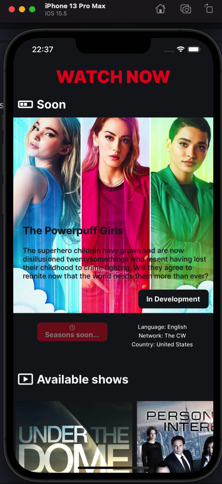
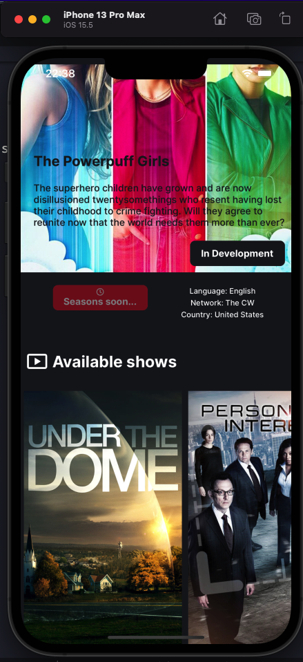
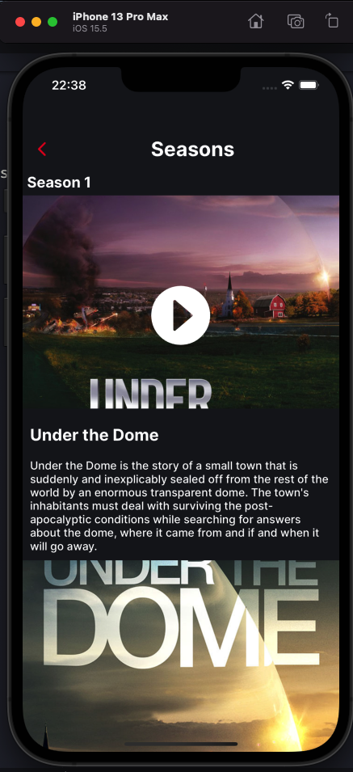
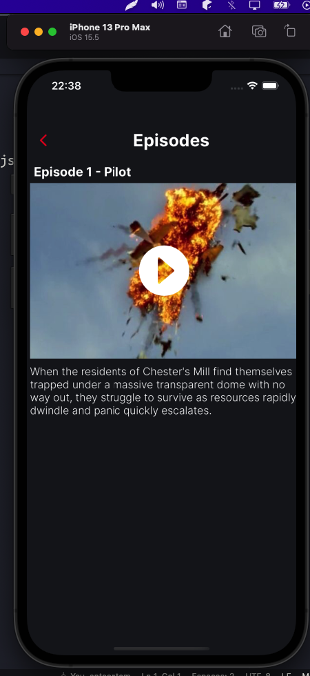

# watch-now

Watch now is an open source project built on top of the [TvMaze API](https://www.tvmaze.com/), which shows available shows to watch, as well as their seasons and episodes.

Overview:

- [watch-now](#watch-now)
  - [How to setup the project](#how-to-setup-the-project)
    - [Install the dependencies](#install-the-dependencies)
    - [Start the project in IOS or Android](#start-the-project-in-ios-or-android)
      - [IOS](#ios)
      - [Android](#android)
      - [Tunnel](#tunnel)
  - [Missing requirements/features](#missing-requirementsfeatures)
    - [Product](#product)
    - [Tech](#tech)
  - [Screenshots](#screenshots)
    - [Home Screen](#home-screen)
    - [Seasons Screen](#seasons-screen)
    - [Episodes Screen](#episodes-screen)

---

## How to setup the project

First of all, make sure you have the requirements installed on your system:

```
Node: v16.15+ (LTS)
Yarn: 1.22.18+
Expo: 5.4.12+
```

### Install the dependencies

```bash
yarn install --frozen-lockfile
```

### Start the project in IOS or Android

#### IOS

```bash
yarn ios
```

#### Android

```bash
yarn android
```

#### Tunnel

```bash
yarn start --tunnel
```

---

## Missing requirements/features

### Product

- Rethink the brand
- Design a sketch (black & white)
- Design the UI/UX
- Update assets (app icon, etc)
- Create a storytelling

### Tech

- Add Lint (eslint and prettier)
- Add Animations (Motti for loading skeletons and Lottie for animations)
- Add UI Tests (Unit and snapshots)
- Add API Tests and mocks (Unit, e.g use some library for mocks like Mirage.js)
- Expo Snack for be easily to test, without need to download and setup
- Have a pipeline to ensure testing and reliability

---

## Screenshots

### Home Screen




### Seasons Screen



### Episodes Screen


